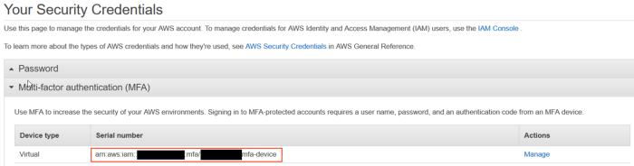

aws-mfa: Easily manage your AWS Security Credentials when using Multi-Factor Authentication (MFA)
=================================================================================================

**aws-mfa** makes it easy to manage your AWS SDK Security Credentials when Multi-Factor Authentication (MFA) is enforced on your AWS account. It automates the process of obtaining temporary credentials from the [AWS Security Token Service](http://docs.aws.amazon.com/STS/latest/APIReference/Welcome.html) and updating your [AWS Credentials](https://blogs.aws.amazon.com/security/post/Tx3D6U6WSFGOK2H/A-New-and-Standardized-Way-to-Manage-Credentials-in-the-AWS-SDKs) file (located at `~/.aws/credentials`). 

The concept behind **aws-mfa** is that there are 2 types of credentials:

* `long-term` - Your typcial AWS access keys, consisting of an `AWS_ACCESS_KEY_ID` and `AWS_SECRET_ACCESS_KEY`

* `short-term` - A temporary set of credentials that are generated by AWS STS using your `long-term` credentials in combination with your MFA device serial number (either a hardware device serial number or virtual device ARN) and one time token code. Your short term credentials are the credentials that are actively utilized by the AWS SDK in use.


Installation:
-------------
```sh
$ pip install aws-mfa
```


Credentials File Setup
----------------------

In a typical AWS credentials file (located at `~/.aws/credentials`), credentials are stored in sections, denoted by a pair of brackets: `[]`. The `[default]` section stores your default credentials. You can store multiple sets of credentials using different profile names. If no profile is specified, the `[default]` section is always used.

After installing **aws-mfa**, by default long term credential sections are identified by the convention `[<profile_name>-long-term]` and short term credentials are identified by the typical convention: `[<profile_name>]`. The following illustrates how you would configure you credentials file using **aws-mfa** with your default credentials:

 This is how your  AWS credentials file (located at ~/.aws/credentials) looks at first :
```ini
[default]
aws_access_key_id = YOUR_LONGTERM_KEY_ID
aws_secret_access_key = YOUR_LONGTERM_ACCESS_KEY
```

You need to modify the  AWS credentials file (located at ~/.aws/credentials) and change the profile from the default convention [<profile_name>] to [<profile_name>-long-term] in order to be able to run **aws-mfa**

After running `aws-mfa`, your credentials file would look like:

```ini
[default-long-term]
aws_access_key_id = YOUR_LONGTERM_KEY_ID
aws_secret_access_key = YOUR_LONGTERM_ACCESS_KEY


[default]
aws_access_key_id = <POPULATED_BY_AWS-MFA>
aws_secret_access_key = <POPULATED_BY_AWS-MFA>
aws_security_token = <POPULATED_BY_AWS-MFA>
```

Similarly, if you utilize a credentials profile named **development**, your credentials file would look like:

```ini
[development-long-term]
aws_access_key_id = YOUR_LONGTERM_KEY_ID
aws_secret_access_key = YOUR_LONGTERM_ACCESS_KEY
```


After running `aws-mfa`, your credentials file would look like:

```ini
[development-long-term]
aws_access_key_id = YOUR_LONGTERM_KEY_ID
aws_secret_access_key = YOUR_LONGTERM_ACCESS_KEY

[development]
aws_access_key_id = <POPULATED_BY_AWS-MFA>
aws_secret_access_key = <POPULATED_BY_AWS-MFA>
aws_security_token = <POPULATED_BY_AWS-MFA>
```


Usage Example
-------------

Once installed you need to :

1.Ensure you have MFA enabled and configured for your account using a virtual MFA device, such as Google Authenticator or Authy in our case on your phone.

2.Make sure you did the  modifications to your AWS credentials file (usually found @ ~/.aws/credentials)/


Now you can run **aws-mfa** *before* running any of your scripts that use any AWS SDK.

Using command line arguments:

```sh
$> aws-mfa --duration 1800 --device arn:aws:iam::123456788990:mfa/dudeman --profile default
INFO - Using profile: default
INFO - Your credentials have expired, renewing.
Enter AWS MFA code for device [arn:aws:iam::123456788990:mfa/dudeman] (renewing for 1800 seconds):123456
INFO - Success! Your credentials will expire in 1800 seconds at: 2015-12-21 23:07:09+00:00
```

Using environment variables:

```sh
export MFA_DEVICE=arn:aws:iam::123456788990:mfa/dudeman
export MFA_STS_DURATION=1800
export AWS_PROFILE=default
$> aws-mfa
INFO - Using profile: default
INFO - Your credentials have expired, renewing.
Enter AWS MFA code for device [arn:aws:iam::123456788990:mfa/dudeman] (renewing for 1800 seconds):123456
INFO - Success! Your credentials will expire in 1800 seconds at: 2015-12-21 23:07:09+00:00
```

Output of running **aws-mfa** while credentials are still valid:

```sh
$> aws-mfa
INFO - Using profile: default
INFO - Your credentials are still valid for 1541.791134 seconds they will expire at 2015-12-21 23:07:09
```
Additinoal information
-------------

Something which is important is that in order for **aws-mfa** to know which MFA device to relate to your account, you’ll need to go into the AWS console and get the ARN of your MFA device. Navigate into the aws console, go to IAM / Your Security Credentials and selection Multi-factor Authentication.

You should see your MFA device in the list.


