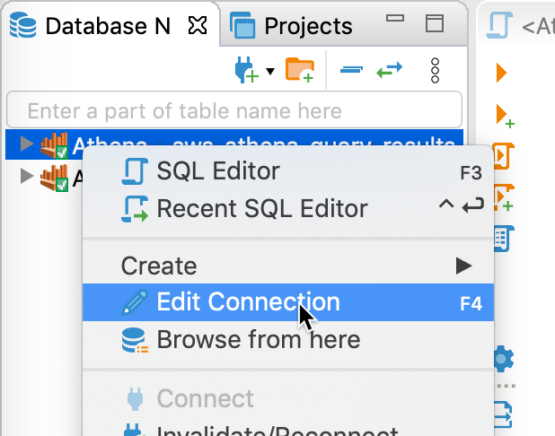
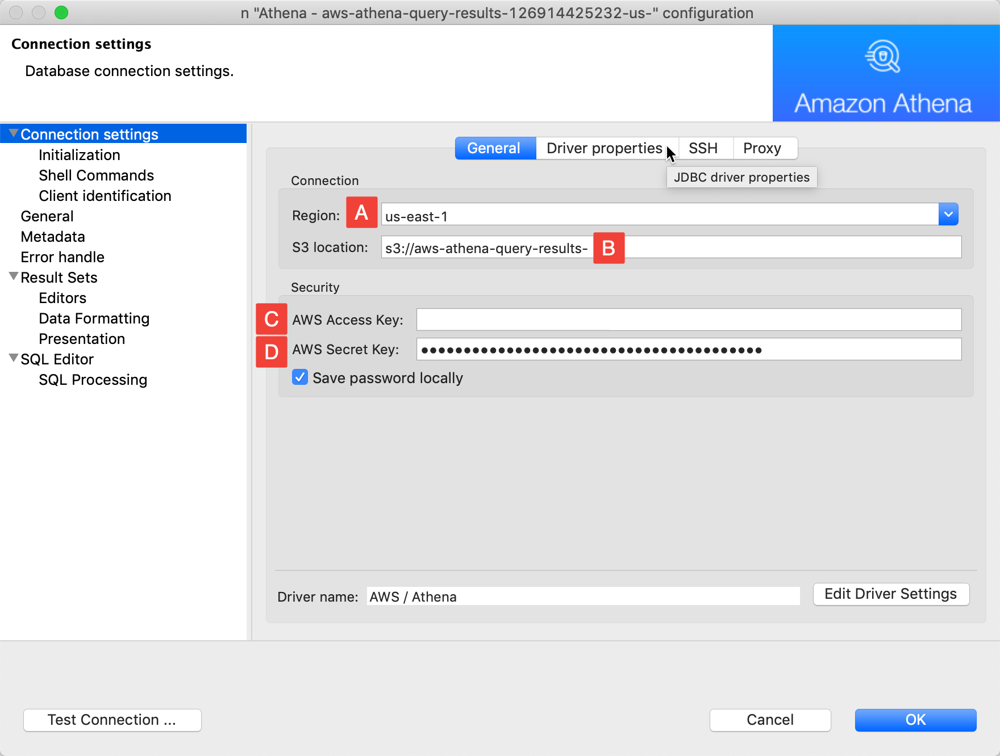
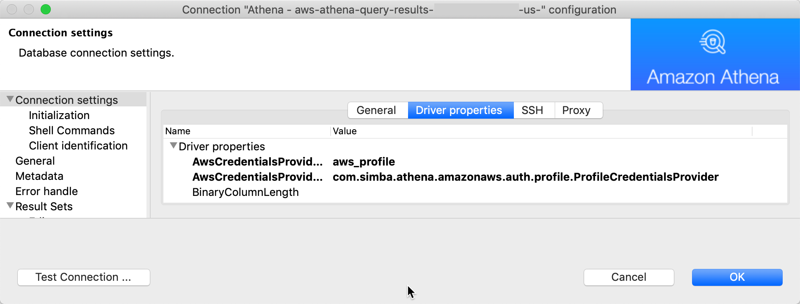
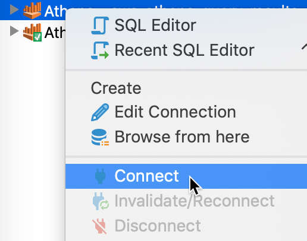

# Connect to Athena With Session Tokens via DBeaver

Please follow the following steps in order to connect to DBeaver , after setting the aws-mfa

## Configure DBeaver to use tokens
1. Download and install the Athena JDBC driver to DBeaver
2. Create a new database connection. Normally you need 4 things to start quering your data:
```text
a. AWS Region (us-west-2)
b. S3 Endpoint
c. Access Key ( leave empty ) 
d. Secret Key ( leave empty ) 
```
Select the new Athena connection, and press F4, or right-click the connection name and select Edit Connection to edit connection details.



If you have an additional layer of security and use session tokens (for example, aws session token), you need to configure the Athena driver to use it. Open Driver properties tab.



There are two parameters here you need to change to make use of local aws credential profiles.
A. AwsCredentialsProviderArguments (this is the name of you AWS profile stored in .aws folder)
aws_credentials_profile B. AwsCredentialsProviderClass (Driver class which allows to use session tokens)
com.simba.athena.amazonaws.auth.profile.ProfileCredentialsProvider



Change them and click **OK** to apply new settings.

## Connect to Athena via the new connection




